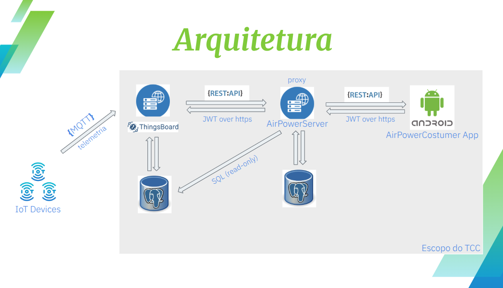

# 🎓 Projeto de TCC: Servidor Remoto (Backend)

Este repositório contém o código-fonte do servidor backend desenvolvido para o Trabalho de Conclusão de Curso. Ele é responsável por toda a lógica de negócio, gerenciamento do banco de dados e por fornecer uma API RESTful para a comunicação com o cliente Android.

---

## 📋 Índice

- [🏗️ Arquitetura do Sistema](#️-arquitetura-do-sistema)
- [✨ Funcionalidades](#-funcionalidades)
- [🚀 Tecnologias Utilizadas](#-tecnologias-utilizadas)
- [🔌 Endpoints da API](#-endpoints-da-api)
- [🔧 Pré-requisitos](#-pré-requisitos)
- [⚙️ Instalação e Configuração](#️-instalação-e-configuração)
- [▶️ Como Executar](#️-como-executar)
- [👨‍💻 Autor](#-autor)

---

## 🏗️ Arquitetura do Sistema

Servidor **AirPowerServer** atua como um servidor de proxy para os recursos do **ThingsBoardServer** fornecendo os dados  que o cliente, **AirPowerCustomerApp**, precisa de forma resumida e otimizada além de fornecer recursos adicionais ao sistema. 

### Cliente (Aplicativo Android)

- Interface com o usuário final.
- Responsável por coletar entradas e exibir dados.
- Realiza requisições HTTP (GET, POST, PUT, DELETE) para a API REST.

### API REST (Servidor Backend)

- Construída com SpringBoot
- Expõe endpoints para interação com os recursos do sistema.
- Responsável por validação de dados, autenticação/autorização e lógica de negócio.
- Comunicação via JSON.

### Banco de Dados

- Utiliza PostgreSQL.
- Armazena dados da aplicação (usuários, registros, etc).

---

## ✨ Funcionalidades

- **Autenticação Segura**: Cadastro, login com senhas criptografadas e JWT.
- **CRUD**: Operações básicas para os recursos da aplicação.
- **Validação de Dados**: Garante formato correto antes do processamento.
- **Relacionamentos**: Entidades como "usuário" e seus registros.

---

- ## 🚀 Tecnologias Utilizadas

- **Linguagem**: Kotlin (JVM)

- **Framework Principal**: Spring Boot 3.5

- **Frameworks Adicionais**: Spring Web, Spring Security, Spring Data JPA, Spring Validation

- **Banco de Dados**: PostgreSQL

- **ORM**: JPA (Jakarta Persistence API)

- **Cliente HTTP**: Ktor Client (com suporte a Content Negotiation e Serialization)

- **Autenticação**:

  - JSON Web Token (JWT - `jjwt` e `java-jwt`)
  - Spring Security

- **Validação de Dados**: Jakarta Validation (JSR-380)

- **Hash de Senhas**: Bcrypt.js

- **Logging**: Logback Classic

- **Outros**:

  - Kotlin Coroutines com Reactor
  - Lombok (compileOnly)
  - Apache HttpClient 5

---

## 🔌 Endpoints da API

### Autenticação (`/auth`)

- `POST /auth/register`: Registra novo usuário
- `POST /auth/login`: Autentica e retorna token JWT

### Usuários (`/users`)

- `GET /users/me`: Dados do usuário autenticado *(rota protegida)*

### Recurso Principal (`/health-data`)

- `POST /health-data`: Cria registro *(protegido)*
- `GET /health-data`: Lista registros *(protegido)*
- `GET /health-data/:id`: Obtém registro específico *(protegido)*
- `PUT /health-data/:id`: Atualiza registro *(protegido)*
- `DELETE /health-data/:id`: Deleta registro *(protegido)*

---

## 🔧 Pré-requisitos

- Java 17 (ou superior)
- Kotlin 1.9.25
- Git
- Instância PostgreSQL local ou na nuvem

### 👨‍💻 Autor

- **[Willian Santos]** - [pro.wj.santos@gmail.com]